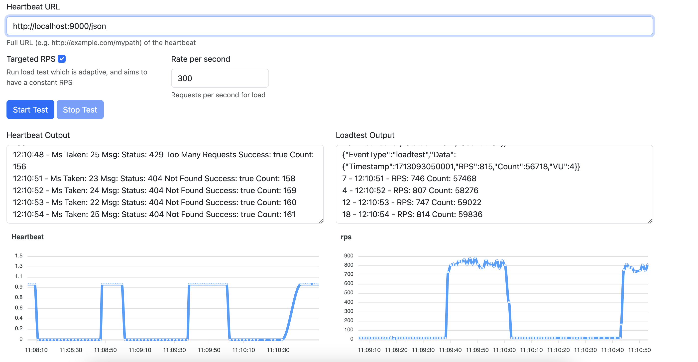

# LoadTestBlocker
Load testing a URL with a L7 Flood.

## Running
Run the web app
`go run ./cmd/web/main.go`

Then visit `http://localhost:8080` in a browser.

### Running a load test
Enter in the URL you want to load test, and press the 'Start Test' button.

### Screenshot

